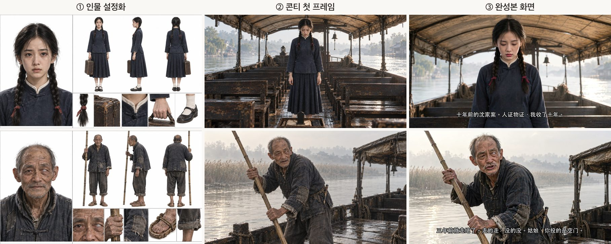
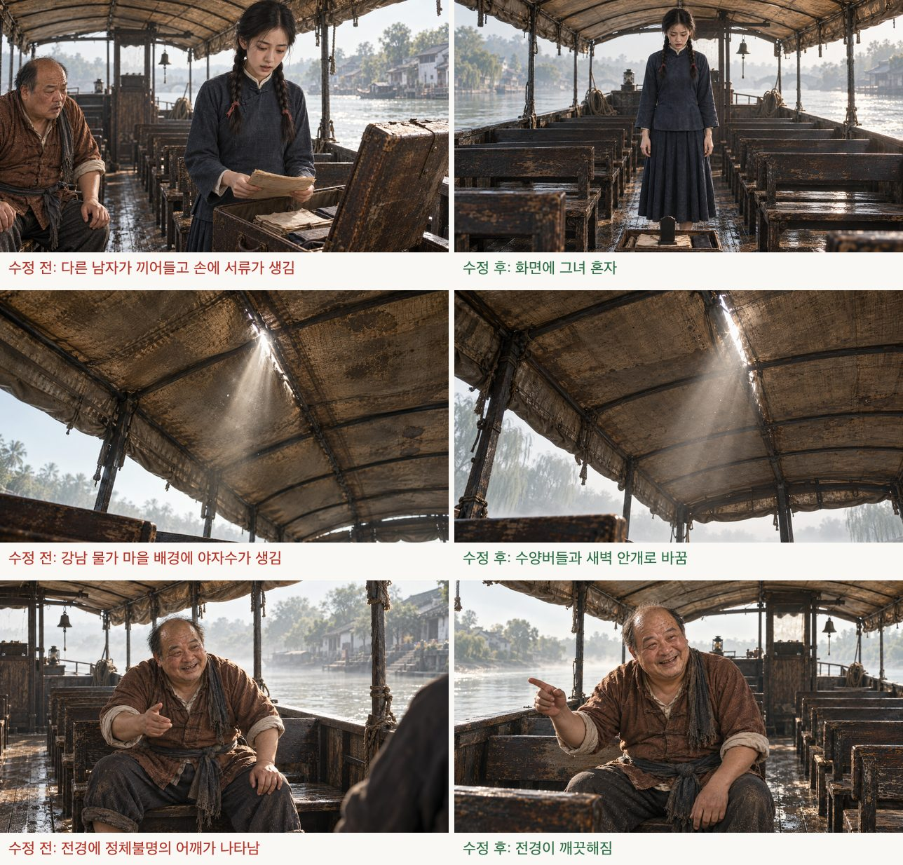

<p align="center">
  <picture>
    <source media="(prefers-color-scheme: dark)" srcset="assets/logo-dark.svg">
    
  </picture>
</p>

<p align="center"><b>이야기 한 편을, 여러 화짜리 숏드라마로.</b><br>
<sub>Turn a short story into an episodic AI drama — script, storyboard, frames, video, subtitles.</sub></p>

<p align="center"><a href="README.zh.md">中文</a> | <a href="README.md">English</a> | <b>한국어</b></p>

---

dramazing은 AI 어시스턴트용 skill입니다([Agent Skills](https://agentskills.io) 형식이라 Claude Code, Codex CLI 등이 읽을 수 있습니다). 중국어, 영어 또는 한국어로 된 단편 이야기를 주면, 인물과 대사가 있고 하드 자막이 들어간 숏드라마 완성본을 한 화씩 함께 만들어 갑니다. 한 화는 약 2분이며, 흔히 말하는 AI 숏드라마, 숏폼 드라마입니다. 화풍을 애니메이션으로 바꾸면 AI 애니메이션 드라마도 만들 수 있습니다(지금까지는 실사 화풍만 실측했습니다).

이미지 도구와 영상 도구는 모두 바꿀 수 있습니다. 과정은 각 단계의 입력과 출력만 정하고, 도구는 어댑터로 연결합니다.

이 과정은 6화짜리 숏드라마 한 편을 다 만든 뒤에 정리한 것입니다. 모든 규칙은 실제 영상 생성에서 생긴 문제에서 나왔고, `references/`에 그 출처를 밝혀 두었습니다.

## 언어

| 이야기 언어 | 실측 현황 |
|---|---|
| 중국어 | 6화짜리 작품(《渡口(나루터)》) 한 편을 끝까지 만들었고, 말 속도 3자/초는 실측값 |
| 영어 | 10초 시험 컷 1개(Grok): 대사가 한 단어도 틀리지 않았고 입 모양과 화면이 안정적; 말 속도 실측 2.2단어/초(표본 1개) |
| 한국어 | 10초 시험 컷 1개(Grok): 대사를 바르게 말했고 입 모양과 화면이 안정적; 말 속도 실측 4.5음절/초(표본 1개) |

문서는 중국어, 영어, 한국어 세 가지 판이 있고 내용은 같습니다: `references/zh/`, `references/en/`, `references/ko/`. 중국어가 원본이고, 영어판과 한국어판은 AI가 번역했으며, 한국어판은 아직 원어민 검토를 거치지 않았습니다. 스크립트가 출력하는 안내도 세 언어로 나오며, 기본값은 이야기 언어를 따르고 환경 변수 `DRAMAZING_LANG`으로 지정할 수 있습니다.

## 결과물

아래 화면은 모두 예시 《渡口》의 완성본과 중간 산출물에서 가져왔습니다. 이미지는 Codex, 영상은 Grok으로 생성했습니다. 《渡口》는 중국어 이야기라서 하드 자막도 중국어입니다.

<p align="center"></p>
<p align="center"><sub>6화 03-2: 카메라가 전신에서 가슴 위까지 천천히 다가가다가, 그녀가 「我收了十年」(10년 동안 모아 왔어요)이라고 말을 마칠 때 멈춥니다. 카메라 움직임, 입 모양, 대사가 모두 한 프롬프트에 들어 있습니다.</sub></p>


**같은 인물이 설정화에서 첫 프레임, 완성본까지.** 설정화가 생김새와 의상을 고정하고, 첫 프레임이 구도를 고정하며, 영상 도구는 화면을 움직이게만 합니다. 老周(노주)의 왼쪽 눈은 뿌옇게 흐려져 있습니다. 이 특징은 `project.json`에서 그의 `trait` 필드에 적혀 있어, 그가 정면으로 나오는 프롬프트에 자동으로 들어갑니다. 그래서 완성본에서도 유지됩니다.



**영상을 생성하기 전에 첫 프레임부터 검토합니다.** 이미지 도구는 흔히 이런 실수를 합니다: 사람이 한 명 더 생기거나, 배경이 시대와 맞지 않거나, 전경에 정체 모를 물건이 나타납니다. 첫 프레임 단계에서 고치는 편이 영상을 생성한 뒤 재작업하는 것보다 훨씬 쌉니다.



## 작동 방식

```
원문 ──AI 어시스턴트 작성──▶ 설정 / 대본 / 콘티 ──이미지 도구──▶ 설정화 + 컷별 첫 프레임
                                                                                  │
                            ┌─── 관문 1: 서사 미리보기, 이야기가 이해되는지 확인 ◀┘
                            ▼
           컷마다 영상 프롬프트 생성 ──▶ 관문 2: 시험 컷, 화질과 입 모양 확인
                                                            │
                                                            ▼
            영상 도구가 첫 프레임으로 영상 생성 ──▶ 편집, 대사 정렬 ──▶ 검수본 ──▶ 하드 자막 완성본
```

| 단계 | 누가 하나 | 실측한 도구 | 바꿀 수 있는 도구 |
|---|---|---|---|
| 화 나누기, 인물 설정, 대본, 콘티 | AI 어시스턴트, `references/ko/writing.md`에 따라 | Claude Code | skill을 읽을 수 있는 어떤 어시스턴트든, 또는 사람이 직접 |
| 설정화, 컷별 첫 프레임 | `scripts/frames.mjs`가 작업 목록 생성 | Codex CLI | 어떤 이미지 도구든 수동으로, 또는 직접 쓰는 명령줄 연결([설명](references/ko/adapters/image.md)) |
| 영상 프롬프트와 사전 점검 | `scripts/video-prompts.mjs` | Grok용 작성법 | 범용 작성법, 또는 직접 target 작성([설명](references/ko/adapters/video-other.md)) |
| 영상 생성 | 사용자나 AI 어시스턴트가 영상 도구의 정상 화면에서 조작 | Grok 웹 | Kling, Jimeng, Veo, Runway 등, 미실측 |
| 편집, 이어 붙이기, 자막, 검수본 | `cut.py`, `assemble.mjs`, `review.py`, `burn-subs.py` | ffmpeg + whisper.cpp | — |

「Codex로 이미지 생성 + Grok으로 영상 생성」 조합만 작품 한 편을 끝까지 만들어 봤습니다. 다른 도구로 바꾸면 1화에서 시험 컷을 몇 개 더 생성해 보세요.

## 설치

AI 어시스턴트가 skill을 읽는 폴더에 저장소를 클론합니다. 예를 들어 Claude Code라면:

```bash
git clone https://github.com/azrianobr/dramazing ~/.claude/skills/dramazing
```

그다음 「이 이야기를 숏드라마로 만들어 줘」라고 말하거나 `/dramazing`을 입력합니다. 다른 어시스턴트는 그 어시스턴트가 skill을 읽는 위치에 두거나, `SKILL.md`를 직접 읽게 하면 됩니다.

Claude Code 플러그인으로 설치할 수도 있습니다.

```
/plugin marketplace add azrianobr/dramazing
/plugin install dramazing@dramazing
```

플러그인으로 설치하면 명령은 `/dramazing:dramazing`입니다.

### 의존성

- Node.js 18+, Python 3 + Pillow, ffmpeg
- [whisper.cpp](https://github.com/ggerganov/whisper.cpp)(`whisper-cli`), 모델 `ggml-large-v3-turbo`와 `ggml-silero-v5.1.2`를 `~/models/whisper`에 둡니다(`WHISPER_MODELS`로 변경 가능)
- 참고 이미지를 넣을 수 있는 이미지 도구(실측: [Codex CLI](https://github.com/openai/codex))
- 「첫 프레임 + 텍스트 → 영상」 방식이고 이야기 언어로 대사를 말할 수 있는 영상 도구(실측: Grok 웹의 Imagine)
- 지금은 macOS에서만 테스트했습니다. 자막 글꼴은 기본으로 macOS에 들어 있는 중국어, 영어, 한국어 글꼴을 씁니다(`SUB_FONT`로 변경 가능)

## 폴더 구성

```
SKILL.md              skill 진입점(영어. SKILL.zh.md, SKILL.ko.md는 사람이 읽는 번역본)
.claude-plugin/       Claude Code 플러그인·마켓플레이스 매니페스트
references/zh|en|ko/  과정, 작성 규칙, 데이터 형식, 프롬프트와 카메라 움직임 규칙, 회고 템플릿
  adapters/           이미지 생성, Grok 영상 생성, 그 밖의 영상 도구
scripts/              검증, 이미지 생성, 프롬프트, 미리보기, 영상 수집, 편집, 이어 붙이기, 검수, 자막
  targets/            영상 프롬프트의 도구별 작성법: grok, generic
  lang/               이야기 언어별 매개변수와 프롬프트 고정 문장
assets/               로고(밝은 / 어두운 테마), 아이콘, README 예시 이미지, 소셜 미리보기
templates/zh|en|ko/   빈 project / script / storyboard
examples/渡口/         전체 예시(중국어): 6화 분량의 설정, 대본, 콘티
examples/last-tram/   영어 한 화짜리 작은 예시
examples/majimak-jeoncha/  한국어 한 화짜리 작은 예시(같은 이야기의 한국어판)
```

## 예시

`examples/渡口/`는 6화 분량의 전체 예시입니다. 원작은 烁皓(삭호)가 [shuohao-skills](https://github.com/eternityspring/shuohao-skills)용으로 쓴 예시 이야기 《渡口》(Apache-2.0)입니다. 우리는 대본을 각색하고 콘티를 모두 작성했습니다. 출처와 변경 사항은 [`examples/渡口/NOTICE.md`](examples/渡口/NOTICE.md)를 보세요.

`examples/last-tram/`(영어)와 `examples/majimak-jeoncha/`(한국어)는 영어와 한국어를 테스트하려고 이 프로젝트를 위해 새로 쓴 짧은 이야기이며, 저장소의 다른 내용과 마찬가지로 Apache-2.0으로 배포합니다.

```bash
node scripts/validate.mjs     --work examples/渡口 --ep 1
node scripts/video-prompts.mjs --work examples/渡口 --ep 1 --target grok --out /tmp/dz-test
```

## 영상 생성에 대해

이 skill에는 웹 자동화 스크립트가 들어 있지 않습니다. 영상은 영상 도구의 정상적인 화면이나 공개 API에서 생성하고, 도구의 이용 약관을 지키세요. 스크립트로 페이지의 제한, 심사, 과금을 우회하지 마세요.

## 감사의 말

- 카메라 움직임 규칙은 AdrianPunk의 「AI 영상 카메라 움직임 사전」(《AI 视频运镜词典》) [상편](https://x.com/adrianpunk115/status/2104172387575222768)과 [하편](https://x.com/adrianpunk115/status/2104523576020017575)을 참고해, 우리의 실측 결과에 맞춰 다시 정리했습니다.
- 예시 이야기 《渡口》는 烁皓의 [shuohao-skills](https://github.com/eternityspring/shuohao-skills)에서 가져왔습니다.

## 라이선스

[Apache License 2.0](LICENSE). 예시 폴더의 제3자 저작권 고지는 [NOTICE](NOTICE)를 보세요.
