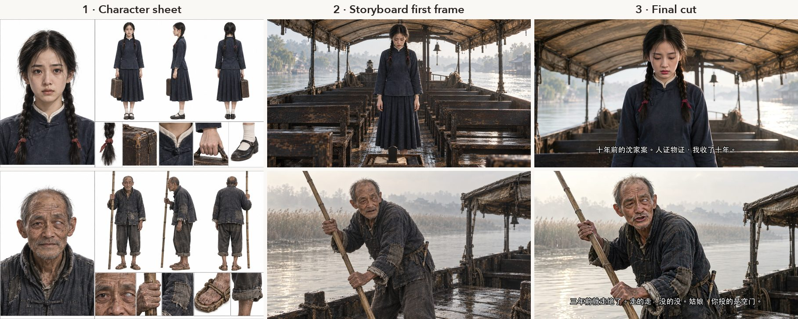
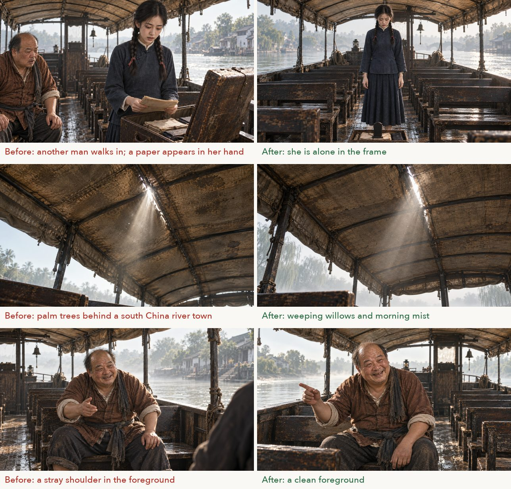

<p align="center">
  <picture>
    <source media="(prefers-color-scheme: dark)" srcset="assets/logo-dark.svg">
    
  </picture>
</p>

<p align="center"><b>From one story to an episodic short drama.</b><br>
<sub>Turn a short story into an episodic AI drama — script, storyboard, frames, video, subtitles.</sub></p>

<p align="center"><a href="README.zh.md">中文</a> | <b>English</b> | <a href="README.ko.md">한국어</a></p>

---

dramazing is a skill for AI assistants (in the [Agent Skills](https://agentskills.io) format, readable by Claude Code, Codex CLI and others). Give it a short story in Chinese, English or Korean, and it walks you through making a short drama episode by episode, with characters, dialogue and burned-in subtitles: what is often called an AI short drama or micro drama. Landscape episodes run about 2 minutes each; it also makes 9:16 vertical shorts of 35 to 50 seconds. Set the style to anime and it makes AI animated dramas too (only the realistic style has been tested so far).

Both the image tool and the video tool can be swapped. The workflow defines only the inputs and outputs of each step; tools plug in through adapters.

The workflow was written up after making a 6-episode landscape drama and three vertical shorts. Every rule comes from a real problem in video generation, and `references/` notes where each one came from.

## Language

| Story language | Testing status |
|---|---|
| Chinese | A complete 6-episode work (*Dukou (渡口)*); the speech rate of 3 characters/second is measured; also three 9:16 vertical shorts (37–47 seconds) |
| English | One 10-second trial shot (Grok): the line came out word for word, lips and picture stable; measured speech rate 2.2 words/second (1 sample) |
| Korean | One 10-second trial shot (Grok): the line came out right, lips and picture stable; measured speech rate 4.5 syllables/second (1 sample) |

The docs come in Chinese, English and Korean, with the same content: `references/zh/`, `references/en/`, `references/ko/`. The Chinese docs are the original; the English and Korean docs are AI translations, and the Korean ones still need review by a native speaker. Script messages also come in the three languages. They follow the story language by default; set the environment variable `DRAMAZING_LANG` to choose one.

## What it looks like

All images below come from the final cuts and intermediate files of the *Dukou* example: images by Codex, video by Grok. *Dukou* is a Chinese story, so the burned-in subtitles are in Chinese.

<p align="center"></p>
<p align="center"><sub>Episode 6, 03-2: the camera slowly pushes in from a full shot to a chest-up close shot, and stops as she finishes the line 「我收了十年」 ("ten years I've gathered it"). The camera move, lip sync and dialogue are all written in the same prompt.</sub></p>


**The same character, from sheet to first frame to final cut.** The sheet locks the face and costume, the first frame locks the composition, and the video tool only has to make the picture move. 老周's left eye is clouded milky white. This feature is written in his `trait` field in `project.json`, and every prompt where he faces the camera includes it automatically, so it is still there in the final cut.



**Check the first frames before generating video.** Image tools often make these mistakes: an extra person, a background from the wrong period, an unexplained object in the foreground. Fixing them at the first-frame stage is much cheaper than reworking after the video is made.



## How it works

```
Source story ──AI assistant──▶ setting / script / storyboard ──image tool──▶ sheets + first frames
                                                                                       │
                         ┌─── Gate 1: narrative preview, is the story easy to follow? ◀┘
                         ▼
               video prompts, one per cut ──▶ Gate 2: trial shot, check image quality and lip sync
                                                  │
                                                  ▼
video tool animates first frames ──▶ cut, align dialogue ──▶ review cut ──▶ final cut with burned-in subtitles
```

| Stage | Who does it | Tested tool | Can be replaced by |
|---|---|---|---|
| Episodes, characters, script, storyboard | The AI assistant, following `references/en/writing.md` | Claude Code | Any assistant that can read skills, or write them by hand |
| Sheets, first frame of each cut | `scripts/frames.mjs` writes the task list | Codex CLI | Any image tool by hand, or your own command line ([details](references/en/adapters/image.md)) |
| Video prompts and preflight | `scripts/video-prompts.mjs` | Grok format | The generic format, or write your own target ([details](references/en/adapters/video-other.md)) |
| Video | You or the AI assistant, through the video tool's normal interface | Grok (web) | Kling, Jimeng, Veo, Runway, etc. (not tested) |
| Cutting, assembly, subtitles, review cut | `cut.py`, `assemble.mjs`, `review.py`, `burn-subs.py` | ffmpeg + whisper.cpp | — |

Only the "Codex for images + Grok for video" combination has made complete works: one 6-episode landscape drama and three vertical shorts. With other tools, make a few extra trial shots in the first episode.

## Features

**Aspect ratio.** `aspect` in `project.json` picks landscape 16:9 or vertical 9:16. First frames, prompts, preview, cutting and subtitles all follow it; character and scene sheets stay 16:9. See [`data-format.md`](references/en/data-format.md).

**Storyboard.** All fields are described in [`data-format.md`](references/en/data-format.md):
- Shot sizes: where each of the seven sizes cuts the frame and what must stay in it. `validate.mjs` warns about likely mistakes, such as dialogue in an extreme close-up.
- Attach extra sheets to one cut (`sheets`), move a cut to another location (`place`), and say exactly what a close-up shows (`only`).
- Insert shots (`insert`): existing footage, with no image or video generation; at least 2 seconds.
- Screen replacement (`screen`): put a screen recording onto a screen in the frame.
- Cover (`cover`): the picture switches to a recording or screenshot while the character keeps talking.
- Titles (`title`): name cards and other on-screen text, drawn locally so they never pass through the video model.
- Per-episode intro and outro (`intro` / `outro`), and music and sound-effect tracks (`audio`, lowered automatically under dialogue).

**Cutting.** `cutTail` is in [`data-format.md`](references/en/data-format.md), `fix.json` in [`workflow.md`](references/en/workflow.md), and how much to speed up in section 5 of [`writing.md`](references/en/writing.md):
- `cutTail`: a dialogue shot ends shortly after its line, so characters do not stand idle until the 6 or 10 second clip runs out.
- Dialogue shots speed up toward a target speaking rate (`cut.py --rate`, up to ×1.3). The in point and speed of a single cut go in `fix.json`.
- After writing, the audio and video lengths are compared; a difference over 0.25 seconds stops with an error.

**Subtitles.** `subFont` and `subSize` in `project.json` set the font and size. A two-line Chinese subtitle breaks at the punctuation mark nearest the middle, and the sentence-final full stop is dropped. Each line is aligned by speech recognition to its own cut.

**Checks.** Two gates come before video generation: the narrative preview and the trial shot. Received clips are checked frame by frame for props that appear from nowhere. The final cut is checked for audio-video sync at picture boundaries. See [`workflow.md`](references/en/workflow.md).

**Pacing for vertical shorts.** Shot length, how much to speed up, and how to use silence, measured on the short that played best. See section 5 of [`writing.md`](references/en/writing.md).

## Installation

Clone the repo into the directory where your AI assistant reads skills. For Claude Code:

```bash
git clone https://github.com/azrianobr/dramazing ~/.claude/skills/dramazing
```

Then say "turn this story into a short drama", or type `/dramazing`. For other assistants, put it where they read skills, or just ask them to read `SKILL.md`.

Or install it as a Claude Code plugin:

```
/plugin marketplace add azrianobr/dramazing
/plugin install dramazing@dramazing
```

Installed this way, the command is `/dramazing:dramazing`.

### Dependencies

- Node.js 18+, Python 3 + Pillow, ffmpeg
- [whisper.cpp](https://github.com/ggerganov/whisper.cpp) (`whisper-cli`), with the `ggml-large-v3-turbo` and `ggml-silero-v5.1.2` models in `~/models/whisper` (change with `WHISPER_MODELS`)
- An image tool that accepts reference images (tested: [Codex CLI](https://github.com/openai/codex))
- A "first frame + text → video" tool that can speak dialogue in the story language (tested: Imagine on the Grok website)
- Tested on macOS so far. Subtitles use the Chinese, English and Korean fonts built into macOS by default; their license covers use on that machine only. For a commercial release, set a font cleared for commercial use in `subFont` in `project.json` (the environment variable `SUB_FONT` takes precedence)

## Layout

```
SKILL.md              skill entry (English; SKILL.zh.md and SKILL.ko.md are translations for people to read)
.claude-plugin/       Claude Code plugin and marketplace manifests
references/zh|en|ko/  workflow, writing rules, data format, prompt and camera-move rules, retrospective template
  adapters/           images, Grok video, other video tools
scripts/              validation, images, prompts, preview, ingest, cutting, assembly, review, subtitles
  targets/            video prompt formats per tool: grok, generic
  lang/               settings and fixed prompt sentences for each story language
assets/               logo (light / dark), icon, README showcase images, social preview
templates/zh|en|ko/   empty project / script / storyboard
examples/渡口/         complete example (Chinese): setting, script and storyboard for 6 episodes
examples/last-tram/   small single-episode example in English
examples/majimak-jeoncha/  small single-episode example in Korean (the same story in Korean)
```

## Examples

`examples/渡口/` is a complete 6-episode example. The original is *Dukou*, a sample story written by Shuohao (烁皓) for [shuohao-skills](https://github.com/eternityspring/shuohao-skills) (Apache-2.0). We adapted the script and wrote the whole storyboard. For the source and our changes, see [`examples/渡口/NOTICE.md`](examples/渡口/NOTICE.md).

`examples/last-tram/` (English) and `examples/majimak-jeoncha/` (Korean) are short original stories written for this project to test English and Korean. Like the rest of the repo, they are released under Apache-2.0.

```bash
node scripts/validate.mjs     --work examples/渡口 --ep 1
node scripts/video-prompts.mjs --work examples/渡口 --ep 1 --target grok --out /tmp/dz-test
```

## About video generation

This skill includes no browser automation scripts. Generate video through the video tool's normal interface or public API, follow the tool's terms of service, and do not use scripts to get around the page's limits, moderation or billing.

## Acknowledgements

- The camera-move rules draw on AdrianPunk's *AI Video Camera-Movement Dictionary* ([part 1](https://x.com/adrianpunk115/status/2104172387575222768), [part 2](https://x.com/adrianpunk115/status/2104523576020017575)), reorganized by our own test results.
- The example story *Dukou* comes from Shuohao's [shuohao-skills](https://github.com/eternityspring/shuohao-skills).

## License

[Apache License 2.0](LICENSE). Third-party copyright notices for the example directory are in [NOTICE](NOTICE).
