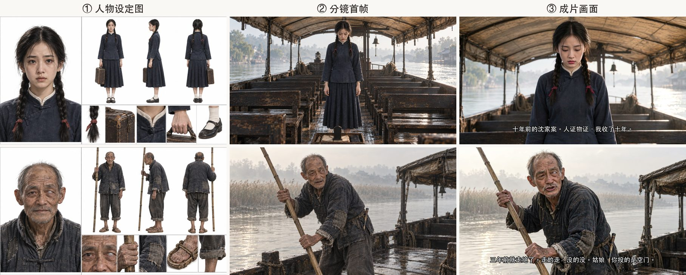

<p align="center">
  <picture>
    <source media="(prefers-color-scheme: dark)" srcset="assets/logo-dark.svg">
    
  </picture>
</p>

<p align="center"><b>把一篇故事，做成一部分集短剧。</b><br>
<sub>Turn a short story into an episodic AI drama — script, storyboard, frames, video, subtitles.</sub></p>

<p align="center"><b>中文</b> | <a href="README.md">English</a> | <a href="README.ko.md">한국어</a></p>

---

dramazing 是一个 AI 助手用的 skill（[Agent Skills](https://agentskills.io) 格式，Claude Code、Codex CLI 等都能读）。给它一篇中文、英文或韩文的短篇故事，它带着你一集一集做出有人物、有对白、带硬字幕的短剧成片，每集约 2 分钟，也就是常说的 AI 短剧、AI 微短剧。画风改成动漫就能做 AI 漫剧（目前只实测过写实画风）。

出图和出片工具都可以换。流程只规定每一步的输入和输出，工具通过适配器接入。

这套流程是做完一部 6 集短剧之后整理出来的。每条规则都来自一次实际出片的问题，在 `references/` 里注明了出处。

## 语言

| 故事语言 | 实测情况 |
|---|---|
| 中文 | 完整做过一部 6 集作品（《渡口》），语速 3 字/秒是实测值 |
| 英文 | 一条 10 秒试探镜头（Grok）：台词一字不差，口型、画面稳定；语速实测 2.2 词/秒（1 条样本） |
| 韩文 | 一条 10 秒试探镜头（Grok）：台词念对，口型、画面稳定；语速实测 4.5 音节/秒（1 条样本） |

文档有中文、英文、韩文三版，内容相同：`references/zh/`、`references/en/`、`references/ko/`。中文是原稿，英文和韩文由 AI 翻译，韩文版待母语者校对。脚本打印的提示也是三种语言，默认跟着故事语言，可用环境变量 `DRAMAZING_LANG` 指定。

## 效果

下面的画面都出自示例《渡口》的成片和中间产物：Codex 出图，Grok 出片。

<p align="center"></p>
<p align="center"><sub>第 6 集 03-2：镜头从全身慢慢推到胸口以上，她说完「我收了十年」时停住。运镜、口型、台词都写在同一条提示词里。</sub></p>


**同一个人物，从设定图到首帧再到成片。** 设定图锁住长相和服装，首帧锁住构图，视频工具只负责让画面动起来。老周的左眼浑浊发白，这个特征写在 `project.json` 里他的 `trait` 字段，他正脸入画的提示词都会自动带上，所以到成片里还在。



**首帧先过一遍再出片。** 出图工具常有这几种错：多出一个人、背景不合年代、前景冒出来历不明的东西。在首帧阶段改掉，比出完视频再返工便宜得多。


## 它怎么工作

```
故事原文 ──AI 助手写──▶ 设定 / 剧本 / 分镜 ──出图工具──▶ 设定图 + 每切首帧
                                                           │
                              ┌─── 关口 1：叙事预览，确认故事看得懂 ◀┘
                              ▼
               逐条生成视频提示词 ──▶ 关口 2：试探镜头，确认画质和口型
                                               │
                                               ▼
              视频工具按首帧出片 ──▶ 剪辑、对齐台词 ──▶ 审片版 ──▶ 硬字幕成片
```

| 环节 | 谁来做 | 实测过的工具 | 可以换成 |
|---|---|---|---|
| 分集、人物设定、剧本、分镜 | AI 助手，按 `references/zh/writing.md` | Claude Code | 任何能读 skill 的助手，或人工写 |
| 设定图、每切的首帧 | `scripts/frames.mjs` 出任务单 | Codex CLI | 手动用任何出图工具，或接你的命令行（[说明](references/zh/adapters/image.md)） |
| 视频提示词和预检 | `scripts/video-prompts.mjs` | Grok 写法 | 通用写法，或自己写一个 target（[说明](references/zh/adapters/video-other.md)） |
| 出片 | 你或 AI 助手，在视频工具里按正常界面操作 | Grok 网页 | 可灵、即梦、Veo、Runway 等，未实测 |
| 剪辑、拼接、字幕、审片版 | `cut.py`、`assemble.mjs`、`review.py`、`burn-subs.py` | ffmpeg + whisper.cpp | — |

只有「Codex 出图 + Grok 出片」这一组完整做过一部作品。换别的工具，第一集先多出几条试探镜头。

## 安装

把仓库克隆到你的 AI 助手读 skill 的目录。比如 Claude Code：

```bash
git clone https://github.com/azrianobr/dramazing ~/.claude/skills/dramazing
```

然后说「把这篇故事做成短剧」，或者输入 `/dramazing`。其他助手放到它读 skill 的位置，或者直接让它读 `SKILL.md`。

也可以作为 Claude Code 插件安装：

```
/plugin marketplace add azrianobr/dramazing
/plugin install dramazing@dramazing
```

用插件方式安装时，命令是 `/dramazing:dramazing`。

### 依赖

- Node.js 18+、Python 3 + Pillow、ffmpeg
- [whisper.cpp](https://github.com/ggerganov/whisper.cpp)（`whisper-cli`），模型 `ggml-large-v3-turbo` 和 `ggml-silero-v5.1.2`，放在 `~/models/whisper`（可用 `WHISPER_MODELS` 改）
- 一个能传参考图的出图工具（实测：[Codex CLI](https://github.com/openai/codex)）
- 一个「首帧 + 文字 → 视频」、能说故事语言台词的视频工具（实测：Grok 网页的 Imagine）
- 目前在 macOS 上测试过。字幕字体默认用 macOS 自带的中文、英文、韩文字体（可用 `SUB_FONT` 改）

## 目录

```
SKILL.md              skill 入口（英文；SKILL.zh.md、SKILL.ko.md 是给人读的译本）
.claude-plugin/       Claude Code 插件和插件市场清单
references/zh|en|ko/  流程、写作规则、数据格式、提示词与运镜规则、复盘模板
  adapters/           出图、Grok 出片、其他视频工具
scripts/              校验、出图、提示词、预览、收片、剪辑、拼接、审片、字幕
  targets/            视频提示词的工具写法：grok、generic
  lang/               各故事语言的参数和提示词固定句子
assets/               logo（浅色 / 深色）、图标、README 展示图、社交预览图
templates/zh|en|ko/   空的 project / script / storyboard
examples/渡口/         完整示例（中文）：6 集的设定、剧本和分镜
examples/last-tram/   英文单集小例子
examples/majimak-jeoncha/  韩文单集小例子（同一个故事的韩文版）
```

## 示例

`examples/渡口/` 是一个完整的 6 集示例。原作是烁皓为 [shuohao-skills](https://github.com/eternityspring/shuohao-skills) 写的样例故事《渡口》（Apache-2.0）。我们改编了剧本，写了全部分镜。来源和改动见 [`examples/渡口/NOTICE.md`](examples/渡口/NOTICE.md)。

`examples/last-tram/`（英文）和 `examples/majimak-jeoncha/`（韩文）是为本项目写的原创小故事，用来测试英文和韩文，和仓库其他内容一样以 Apache-2.0 发布。

```bash
node scripts/validate.mjs     --work examples/渡口 --ep 1
node scripts/video-prompts.mjs --work examples/渡口 --ep 1 --target grok --out /tmp/dz-test
```

## 关于出片

本 skill 不包含网页自动化脚本。出片请在视频工具的正常界面或公开 API 上操作，遵守工具的服务条款，不要用脚本绕过页面的限制、审核或计费。

## 致谢

- 运镜规则参考了 AdrianPunk 的《AI 视频运镜词典》[上篇](https://x.com/adrianpunk115/status/2104172387575222768)、[下篇](https://x.com/adrianpunk115/status/2104523576020017575)，按我们的实测结果重新整理。
- 示例故事《渡口》来自烁皓的 [shuohao-skills](https://github.com/eternityspring/shuohao-skills)。

## 许可

[Apache License 2.0](LICENSE)。示例目录的第三方版权声明见 [NOTICE](NOTICE)。
